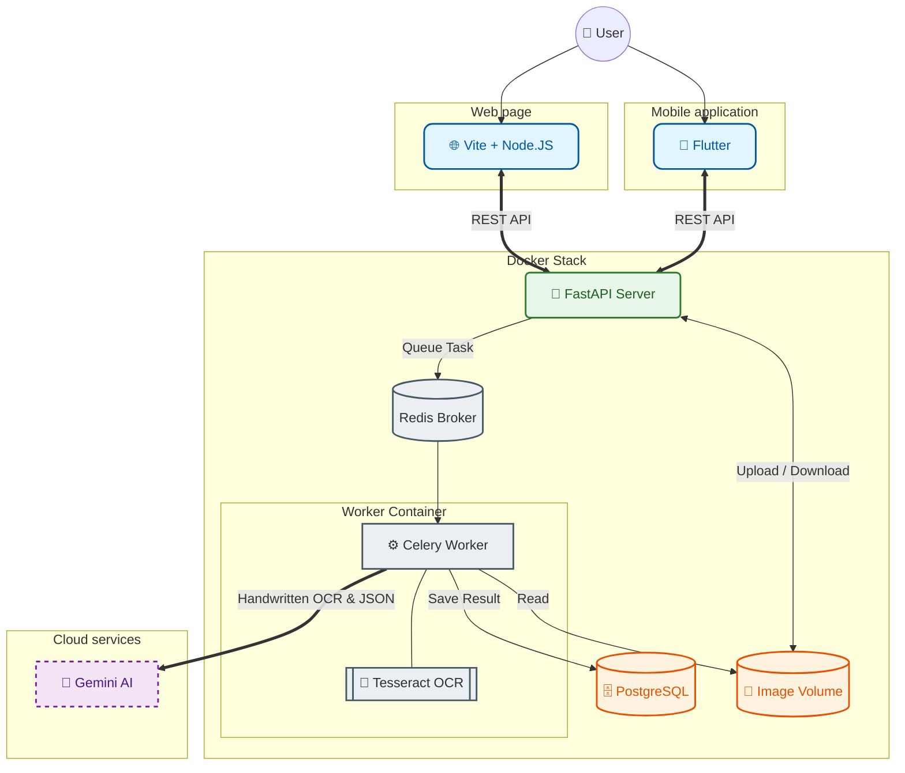

# 🥘 Inteligentny Skaner Przepisów Kulinarnych


[](https://opensource.org/licenses/MIT)


Aplikacja do digitalizacji drukowanych oraz ręcznie pisanych przepisów kulinarnych. System wykorzystuje hybrydowe podejście OCR: 
najpierw lokalny silnik **Tesseract** podejmuje próbę odczytu tekstu, co w przypadku skanów tekstów drukowanych się powodzi, natomiast 
dla skanów przepisów spisanych odręcznie na kartce (lub kartkach) używa **Google Gemini AI**. Odczytane pismo (niezależnie od pochodzenia) 
poddawane jest analizie i strukturyzacji do postaci JSON z użyciem **Google Gemini AI**. Skany zapisane są w podpiętym wolemnie, a ustrukturyzowane 
dane zapisane w bazie PostgreSQL, która te dane indeksuje i umożliwia późniejsze wyszukiwanie pełnotekstowe.


---

## 🏗️ Architektura Systemu

System bazuje na architekturze mikroserwisowej zorkiestrowanej przez Docker Compose. Poniżej znajduje się wizualizacja przepływów danych:



---

## 🛠️ Stack Technologiczny

- **Frontend mobilny:** Flutter (Mobile App) – interfejs użytkownika i obsługa aparatu.
- **Frontend webowy:** Vite + Node - interfejs użytkownika.
- **Backend API:** FastAPI (Python) – lekki i szybki serwer pośredniczący.
- **Asynchroniczność:** Celery + Redis – obsługa zadań OCR w tle.
- **OCR Poziom 1:** Tesseract OCR – silnik zainstalowany lokalnie w kontenerze workera.
- **OCR Poziom 2 & AI:** Google Gemini API – zaawansowana analiza wizualna i strukturyzacja danych.
- **Baza danych:** PostgreSQL – przechowywanie metadanych przepisów oraz JSON.
- **Storage:** Docker Volumes – przechowywanie oryginalnych plików graficznych.

## ⚙️ Pipeline Przetwarzania Danych

1. **Ingest:** Aplikacja mobilna przesyła zdjęcie na endpoint `/recipes/upload`.
2. **Staging:** API zapisuje zdjęcie na wolumenie, tworzy rekord w bazie ze statusem `processing` i zleca zadanie do Redisa.
3. **Lokalny OCR:** Celery Worker próbuje przetworzyć obraz za pomocą Tesseracta.
4. **AI Fallback:** Jeśli tekst jest nieczytelny (np. trudne pismo odręczne), system automatycznie przesyła obraz do Google Gemini.
5. **Strukturyzacja:** Niezależnie od źródła tekstu, Gemini transformuje go w czysty obiekt JSON.
6. **Finalizacja:** Dane JSON oraz ścieżka do zdjęcia są aktualizowane w bazie, a status zmienia się na `processed`.

---

## 🚀 Instalacja i Konfiguracja - backend

### Wymagania

- Docker & Docker Compose
- Klucz API do Google Gemini (do pobrania z Google AI Studio)

### Kroki uruchomienia

1. Sklonuj repozytorium.
2. Utwórz plik `.env` w podkatalogu `server` i uzupełnij dane:
```
GEMINI_API_KEY=twoj_klucz_api
POSTGRES_USER=recipes_user
POSTGRES_PASSWORD=password
POSTGRES_DB=recipes
DATABASE_URL=postgresql+asyncpg://recipes_user:recipes@db:5432/recipes
REDIS_URL=redis://redis:6379/0
```
3. Uruchom cały stos technologiczny:

```bash
cd server
docker-compose up --build
```

## 🚀 Instalacja i Konfiguracja - aplikacja mobilna

### Wymagania

- Android Studio
- Flutter SDK

### Kroki uruchomienia

1. Sklonuj repozytorium.
2. Skopiuj plik `przepisy_flutter/.env.example` na `przepisy_flutter/.env` i wyedytuj wedle potrzeb.
3. Zbuduj aplikację Flutter:
```bash
cd przepisy_flutter
flutter build apk --dart-define-from-file=.env
```
4. Gotowy plik w wersji release znajduje się w `build\app\outputs\flutter-apk\app-release.apk`


## 🚀 Instalacja i Konfiguracja - aplikacja webowa

### Wymagania

- Docker & Docker Compose

### Kroki uruchomienia

1. Sklonuj repozytorium.
2. Utwórz plik `.env` w podkatalogu `client-web` i uzupełnij dane:
```
VITE_API_URL=http://twoje.ip.backendu:8000
```
3. Uruchom cały stos technologiczny:

```bash
cd client-web
docker-compose up --build
```


---

## 📝 Licencja

Projekt udostępniany na licencji MIT.
